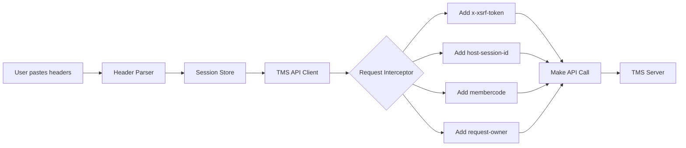

# Authentication Setup for IPO Sniper

## The Cookie Problem

When running the IPO Sniper from `localhost:5173`, the browser prevents setting cookies for `tms56.nepsetms.com.np` due to CORS (Cross-Origin Resource Sharing) and browser security policies.

### What Headers Are Being Sent

The app now sends these authentication headers with every API request:
- `x-xsrf-token` - XSRF protection token
- `host-session-id` - Session identifier
- `membercode` - Member code (e.g., "56")
- `request-owner` - Request owner ID

### What's Missing

The cookies (`XSRF-TOKEN`, `_aid`, `_rid`) cannot be sent by the browser because:
1. **Cookie Domain Restriction**: Cookies for `tms56.nepsetms.com.np` can only be sent to that domain
2. **Forbidden Header**: JavaScript cannot set the `Cookie` header manually
3. **CORS Policy**: Cross-origin requests don't automatically include cookies unless specific conditions are met

---

## Solutions

### ✅ Solution 1: Browser Extension (Recommended for Testing)

Use a browser extension to inject the required headers and cookies:

**Chrome Extensions:**
- **ModHeader** - https://chrome.google.com/webstore/detail/modheader/idgpnmonknjnojddfkpgkljpfnnfcklj
- **Requestly** - https://chrome.google.com/webstore/detail/requestly/mdnleldcmiljblolnjhpnblkcekpdkpa

**Setup with ModHeader:**
1. Install ModHeader extension
2. Create a new profile for "TMS API"
3. Add Request Headers:
   ```
   x-xsrf-token: <your-token>
   host-session-id: <your-session-id>
   membercode: 56
   request-owner: <your-owner-id>
   ```
4. Add Request Cookies:
   ```
   XSRF-TOKEN=<your-token>
   _aid=<your-aid-value>
   _rid=<your-rid-value>
   ```
5. Set filter to match: `*tms56.nepsetms.com.np/*`
6. Enable the profile

### ✅ Solution 2: Open TMS Website First

1. Open https://tms56.nepsetms.com.np in a new tab
2. Log in to TMS
3. Keep that tab open
4. Open the IPO Sniper app in another tab
5. The browser will automatically send cookies for requests to the same domain

**Note**: This only works if both are running on the same origin, which they're not in development.

### ✅ Solution 3: Use the Header Parser

The app includes a smart header parser that handles both raw headers and JSON:

1. Open Chrome DevTools on TMS website (F12)
2. Go to Network tab
3. Click on any API request (e.g., `/ohlc/...`)
4. In the Headers tab, copy the **entire Request Headers** section
5. In IPO Sniper, go to "Session Manager"
6. Paste the copied headers
7. Click "Activate Session"

The parser will extract:
- `x-xsrf-token`
- `host-session-id`
- `membercode`
- `request-owner`
- `cookie` (parsed into XSRF-TOKEN, _aid, _rid)

### ✅ Solution 4: Deploy with Proxy (Production Solution)

For production deployment, set up a backend proxy:

1. Deploy a Node.js server
2. Configure it to:
   - Accept requests from your frontend
   - Add authentication headers/cookies
   - Forward to `tms56.nepsetms.com.np`
   - Return responses to frontend

---

## Debugging

### Check if Headers Are Being Sent

1. Open browser DevTools (F12)
2. Go to Network tab
3. Start Live Monitoring in IPO Sniper
4. Look for requests to `/ohlc/`, `/stockQuote/`, etc.
5. Check Request Headers section

**You should see:**
```
x-xsrf-token: 90c03448-3e1b-4acb-899f-b2b4c87f80d4
host-session-id: TWpRPS01NmQwMmE4Yy02NjUxLTRmYTYtOWVjOS1mNmFiMzE3NWQyZTE=
membercode: 56
request-owner: 25717
```

### Check Console Logs

The app now logs authentication status:

```
[TMS API] Updating session with data: {...}
[TMS API] Session data updated: {
  hasXsrfToken: true,
  hasSessionId: true,
  hasMemberCode: true,
  hasRequestOwner: true,
  hasAid: true,
  hasRid: true
}
[TMS API] Request headers: {
  x-xsrf-token: "...",
  host-session-id: "...",
  membercode: "56",
  request-owner: "...",
  url: "/tmsapi/rtApi/ws/stockQuote/198"
}
```

### Common Issues

**Issue**: "Failed to fetch live price"
- **Cause**: Missing authentication headers
- **Fix**: Paste headers in Session Manager again

**Issue**: "CORS policy" error
- **Cause**: TMS server doesn't allow requests from localhost
- **Fix**: Use browser extension to inject headers

**Issue**: "401 Unauthorized"
- **Cause**: Session expired or invalid tokens
- **Fix**: Get fresh headers from TMS website

**Issue**: Headers sent but still unauthorized
- **Cause**: TMS API might require cookies
- **Fix**: Use browser extension to inject cookies too

---

## How Authentication Works



---

## What's Working Now

✅ **Header Parsing**: Both raw and JSON formats supported
✅ **Header Storage**: Session data persisted in localStorage
✅ **Header Injection**: All required headers added to requests
✅ **Debug Logging**: Console logs show what's being sent
✅ **Error Handling**: Clear error messages when auth fails

❌ **Cookie Injection**: Cannot set cookies from JavaScript (browser limitation)

---

## Recommended Workflow

**For Development/Testing:**
1. Install ModHeader extension
2. Log in to TMS website in one tab
3. Copy headers from DevTools
4. Configure ModHeader with those headers
5. Use IPO Sniper in another tab

**For Production:**
1. Deploy backend proxy server
2. Configure proxy to add authentication
3. Update app to call proxy instead of TMS directly
4. Let proxy handle cookies and headers

---

## Next Steps

If you're still getting authentication errors after pasting headers:

1. **Verify Headers in DevTools**
   - Make sure all 4 headers are present in requests
   - Check values match what you pasted

2. **Try Browser Extension**
   - Install ModHeader or Requestly
   - Add both headers AND cookies
   - Test with a simple API call

3. **Check Session Expiry**
   - TMS sessions may expire quickly
   - Get fresh headers if needed
   - Consider auto-refresh logic

4. **Contact TMS Support**
   - Ask if header-only authentication is supported
   - Request CORS headers to be enabled
   - Get documentation on API authentication
